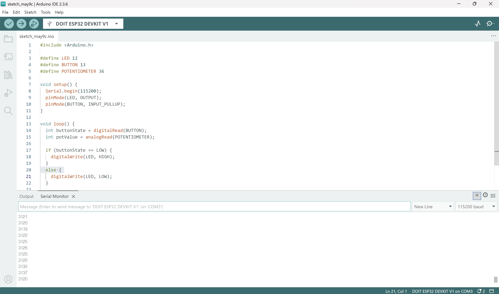

# IoT25-HW02
Assignment 2: Basic Sensor and Actuator Control with ESP32

---

## IDE

---

## Source code
#include <Arduino.h>

#define LED 12
#define BUTTON 13
#define POTENTIOMETER 36

void setup() {
  Serial.begin(115200);
  pinMode(LED, OUTPUT);
  pinMode(BUTTON, INPUT_PULLUP);
}

void loop() {
  int buttonState = digitalRead(BUTTON);
  int potValue = analogRead(POTENTIOMETER);

  if (buttonState == LOW) {
    digitalWrite(LED, HIGH);
  } else {
    digitalWrite(LED, LOW);
  }

  Serial.println(potValue);
  delay(300);
}

## Video
(https://youtu.be/1VDUNc3b5FU?si=p4g_wjjGi9vh61s5)
